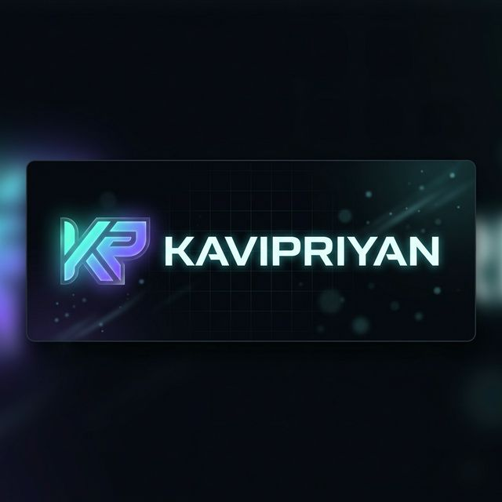

# 🚀 Kavipriyan — Developer Portfolio

<div align="center">



**Full Stack Developer · Flutter · Python · REST APIs**

[](https://developer.mozilla.org/en-US/docs/Web/HTML)
[](https://developer.mozilla.org/en-US/docs/Web/CSS)
[](https://developer.mozilla.org/en-US/docs/Web/JavaScript)
[](https://flutter.dev)
[](https://python.org)

</div>

---

## 📌 Overview

A **dark-themed, animated developer portfolio** built from scratch using pure HTML, CSS, and JavaScript — no frameworks, no dependencies. Designed to showcase Flutter & Python full-stack projects with a premium, modern aesthetic.

> Clean separation of concerns: HTML in `Pages/`, CSS in `Styles/`, JS in `Script/`.

---

## ✨ Features

| Feature | Description |
|---|---|
| 🎨 **Dark Theme** | Deep dark palette with cyan (`#64ffda`) & purple (`#7c6aff`) accents |
| 🖱️ **Custom Cursor** | Animated dot + ring cursor with hover interactions |
| 📱 **Fully Responsive** | Supports all screen sizes: 400px → 1400px+ |
| 🍔 **Hamburger Menu** | Full-screen mobile nav drawer with animated toggle |
| 🎬 **Scroll Animations** | Intersection Observer–powered reveal animations |
| 🏃 **Tech Marquee** | Infinite scrolling tech stack ticker |
| ⏱️ **Timeline** | Animated experience timeline with slide-in transitions |
| 🔡 **Google Fonts** | Syne, DM Mono & Instrument Serif typography |
| 🔝 **SEO Ready** | Proper meta tags, semantic HTML5, descriptive title |
| 🖼️ **Custom Logo** | AI-generated rectangular brand logo |

---

## 📁 Project Structure

```
Portfilio/
│
├── 📄 README.md               ← You are here
│
├── 📂 Pages/
│   └── index.htm              ← Main HTML page
│
├── 📂 Styles/
│   └── style.css              ← All CSS styles & responsive design
│
├── 📂 Script/
│   └── script.js              ← JavaScript (cursor, animations, nav)
│
└── 📂 Images/
    └── logo.png               ← Brand logo (rectangular)
```

---

## 🛠️ Tech Stack

### Frontend
- **HTML5** — Semantic structure
- **CSS3** — Custom properties, Grid, Flexbox, Animations, `clamp()`
- **Vanilla JavaScript** — No frameworks, pure ES6+

### Developer Skills Showcased
- **Flutter** — Mobile & Web (iOS, Android, Desktop)
- **Python** — FastAPI, Django, Flask
- **Databases** — PostgreSQL, MySQL, Firebase, SQLite, Redis
- **DevOps** — Docker, Git, AWS, Firebase Hosting

---

## 📐 Responsive Breakpoints

| Breakpoint | Target |
|---|---|
| `min-width: 1400px` | Large Desktop — wider paddings |
| `max-width: 900px` | Tablet — hamburger menu, single column |
| `max-width: 600px` | Mobile — stacked buttons, smaller type |
| `max-width: 400px` | Small Mobile — compact layout |

---

## 🎨 Design System

### Color Palette

| Variable | Value | Usage |
|---|---|---|
| `--bg` | `#0a0a0f` | Page background |
| `--surface` | `#111118` | Section backgrounds |
| `--card` | `#13131f` | Card backgrounds |
| `--border` | `#1e1e2e` | Borders, dividers |
| `--accent` | `#64ffda` | Primary cyan accent |
| `--accent2` | `#7c6aff` | Purple accent |
| `--flutter` | `#54c5f8` | Flutter blue |
| `--python` | `#ffd43b` | Python yellow |
| `--text` | `#e8e8f0` | Body text |
| `--muted` | `#6b6b8a` | Muted / secondary text |

### Typography
| Font | Usage |
|---|---|
| **Syne** | Headings, names, bold display text |
| **DM Mono** | Body text, nav links, code-style labels |
| **Instrument Serif** | Descriptive paragraphs, elegant text |

---

## 🚀 Getting Started

No build tools or package manager required. Open directly in a browser:

```bash
# Clone or download the project
git clone https://github.com/kavipriyan/portfolio.git

# Open in browser
# Simply double-click Pages/index.htm
# OR use VS Code Live Server extension for auto-reload
```

### Recommended: VS Code + Live Server

1. Install the **Live Server** extension in VS Code
2. Right-click `Pages/index.htm`
3. Select **"Open with Live Server"**
4. Browser opens at `http://127.0.0.1:5500/Pages/index.htm`

---

## 📸 Sections

| Section | Description |
|---|---|
| **Hero** | Name, role, CTA buttons, animated stats |
| **Tech Marquee** | Infinite scrolling skill ticker |
| **About** | Bio, logo display, skill pills |
| **Skills** | 4 skill cards with hover animations |
| **Projects** | Featured + regular project cards with links |
| **Experience** | Animated career timeline |
| **Contact** | Email link + social icon links |
| **Footer** | Copyright and location |

---

## 🔗 Connect

<div align="center">

[](https://github.com/kavipriyan)
[](https://linkedin.com/in/kavipriyan)
[](https://twitter.com/kavipriyan)

</div>

---

## 📝 License

```
MIT License

Copyright (c) 2026 Kavipriyan

Permission is hereby granted, free of charge, to any person obtaining a copy
of this software and associated documentation files (the "Software"), to deal
in the Software without restriction, including without limitation the rights
to use, copy, modify, merge, publish, distribute, sublicense, and/or sell
copies of the Software.
```

---

<div align="center">

Made with ❤️ by **Kavipriyan** · Vattalkundu, TN 🇮🇳

*Built with HTML · CSS · JS — No frameworks, just craft.*

</div>
